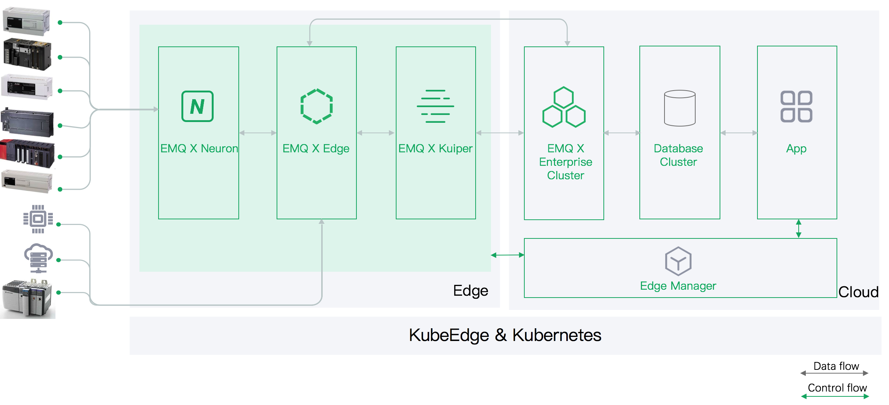

# EMQ X edge stack
[English](README.md)|[简体中文](README-CN.md)

EMQ X Edge Stack 整合了所有 EMQ 边缘软件，用户可以通过一键式部署开始使用Edge Stack。

- Edge Manager: 这是一个基于 Web 的工具，整合了 Neuron 、Edge 和 Kuiper 的管理控制台。用户可以通过基于 Web 的管理控制台来设置 Neuron 配置、管理 MQTT 代理状态和 Kuiper 规则等。 它不是开源的，但是用户可以免费使用它。
- Neuron: [Neuron](https://www.emqx.io/products/neuron) 是一个 IoT 边缘工业协议网关软件，它支持一站式访问数十种工业协议并将其转换为 MQTT 协议，以便访问工业 IoT 云平台。
- Edge: [Edge](https://www.emqx.io/products/edge) 是用于 IoT 的轻量级边缘计算消息中间件，它支持在资源受限的环境中部署边缘硬件。
- Kuiper: [Kuiper](https://www.emqx.io/products/kuiper) 是基于 SQL 的 IoT 流框架，运行在资源受限的边缘设备上。 它持续提取、过滤、转换和路由来自 EMQ X Edge 的数据流。 用户可以利用 Kuiper 进行流分析和配置规则引擎等。
- 数据库：经 Kuiper 处理后的结果可以保存到数据库中，例如`时序数据库`，在我们的演示场景中，我们使用 [TDengine](https://www.taosdata.com/)。
- 应用程序：应用程序从数据库中提取数据，并向最终用户提供交互式 UI。 它还可以将管理 rest-api 发布给 `Edge Manager`，并管理部署在边缘节点的中间件。

## 快速入门

如前一节所述，我们准备了一个[教程文档](developer-scripts/README.md)，使您可以在几分钟内部署基于 docker 和  docker-compose 的演示环境。

## edge stack 和云集成解决方案

如果要管理多个边缘节点，并且您想从云中管理边缘节点，则可以按照以下架构部署 edge stack 软件。 主要区别在于 `Edge Manager` 部署在云端，以便用户可以通过云管理所有边缘中间件。

该解决方案可以基于 Kubernetes 实施，例如在边缘端使用 KubeEdge 来管理中间件部署。

## License

[Apache 2.0](LICENSE)
