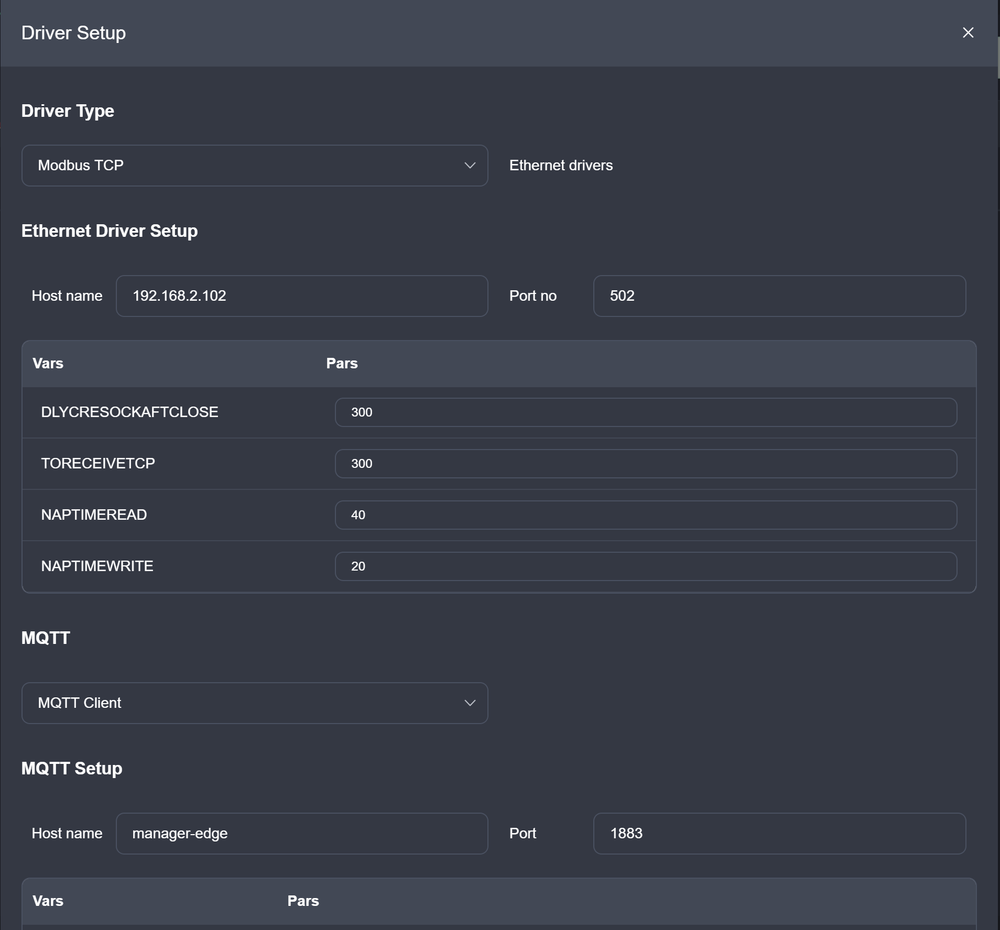

# 开发人员脚本

[English](README.md)|[简体中文](README-CN.md)

该文件夹包含脚本和 docker compose 文件，以快速设置 EMQ X Edge Stack。

## 在 Linux 上运行

### 安装 docker 和 docker-compose

**Docker**

请参阅[安装 docker 文档](https://docs.docker.com/get-docker/)了解更多详细信息。

**Docker-compose**

以下是如何在 centos-7中安装 docker-compose 的示例，您可以通过 Google 找到用于其他 Linux 系统的 docker-compose 安装说明。

https://linuxize.com/post/how-to-install-and-use-docker-compose-on-centos-7/

以下是如何在ubuntu18 arm中安装docker-compose 的示例
```
sudo apt-get install python3 python3-dev python3-pip libffi-dev libevent-dev
pip3 install docker-compose

```

### 启动和运行

为了方便起见，`run.sh` 将帮助您启动和运行。 它将添加：

- 本地的 Kuiper，Neuron 和 Edge 节点；
- 在 Kuiper 中创建连接 Neuron telemetry 的 mqtt 主题的流；
- 在 TDengine 中创建默认数据库，并将其添加到 Grafana 数据源。

```bash
git clone git@github.com:emqx/edge-stack.git
cd $edge-stack
developer-scripts/run.sh
```

### 设置  Neuron

通过点击左侧菜单中的 `Neuron` 来打开 Neuron 仪表板，之后点击 `local_neuron`  节点。 然后进行以下设置。

1. 安装 Modbus 模拟器： *PeakHMISlaveSimulator*。 安装后，打开 **Modbus TCP slave**。

2. 在 neuron 仪表板中，打开配置->对象设置。 点击*编辑驱动程序*，然后设置 modbus tcp 驱动程序和 mqtt。

   - 驱动程序类型： **Modbus TCP**。
   - 主机名：填写运行 Modbus 模拟器的主机。
   - 端口：默认为502。
   - MQTT 主机名： **manager-edge**，这是本地 emqx 边缘节点。
   - MQTT 端口： **1083**。

   

   如果驱动程序设置正确，则 Modbus 模拟器应显示1个客户端已连接并继续接收。 点击“提交”按钮，**Modbus TCP** 成为当前驱动程序。

3. 点击“导入”按钮，选择 [neuron_batch_modbus_5.xlsx](neuron_batch_modbus_5.xlsx)。 对象表中应添加新行。 然后点击右上角的“发送”按钮，这会将配置发送到 Neuron 并重新启动。

4. 现在设置已经完成。 我们需要确认 neuron 已连接到 EMQX edge 节点。

   1. 点击左侧菜单中的 **edge** 。 然后在节点列表中点击 **local_edge** 以进入 EMQX edge 仪表板。
   2. 在 edge 仪表板中，点击左侧菜单中的**客户端** 。 应该显示有一个客户。

### 设置  Kuiper

通过点击左侧菜单中的 `Kuiper` 打开 Kuiper 仪表板，然后点击 `local_kuiper` 节点，进行以下设置。

1. 确认 neuron 流已创建。 在“流管理”标签页的流列表中，确认 neuron 流已自动创建。

2. 切换到“插件”标签页，点击“创建插件”，然后进行如下设置。 这将创建 tdengine 插件，以便可以将规则结果移植到 tdengine。

   

3. 创建规则。 我们将创建一个规则来订阅 Neuron 发布的数据，并将分析结果发送到TDengine。 切换到“规则”标签页，点击“创建规则”。 通过右上角按钮切换到“文本模式”。 填写规则 ID： **ruleNeuron** 或任何你希望的规则名称。 在“文本”字段中输入以下json。

   ```json
   {
     "sql": "SELECT tele[0]->Tag00001 AS temperature, tele[0]->Tag00002 AS humidity FROM neuron",
     "actions": [
       {
         "tdengine": {
           "ip": "taos",
           "port": 0,
           "user": "root",
           "password": "taosdata",
           "database": "db",
           "table": "t",
           "fields": ["temperature","humidity"],
           "provideTs": false,
           "tsFieldName": "ts"
         }
       }
     ]
   }
   ```

4. 点击“提交”，确保规则已启动并正在运行。 点击规则状态，指标中应该有数据输入和输出。

### 在 TDengine 中查询数据

1. 进入 TDengine 的 docker 容器。

   ```bash
   docker exec -it manager-taos /bin/sh      
   ```

2. 规则数据位于数据库 **db** 的表 **t** 中。 通过 SQL 查询数据，例如 `use db;select * from t;`。

### 通过 Grafana 进行数据可视化

默认仪表板是由连接到 TDengin **db.t** 表的脚本自动创建的。通过浏览器打开 **http://yourhost:3000/dashboards** ，点击 **taos** 仪表板。它将直观地显示温度随时间的变化。

## 如何重置测试环境

如果您的环境有任何问题，则可以运行以下命令来重置环境。

```shell
cd developer-scripts
docker-compose -p emqx_edge_stack down
```

*请注意，命令 `docker rm docker ps -qa` 将删除所有 docker 实例，如果您拥有除edge-stacks 以外的 docker 实例并且不想删除所有实例，请一一删除 edge stack 实例。* 


## 附录

### 直接运行 docker compose

默认的运行 compose 文件是 docker-compose.yml。 要运行其他 docker compose 文件，请使用如下命令：

```bash
./run.sh docker-compose-test.yml
```

要停止当前 stack，请在当前文件夹中运行命令：

```bash
docker-compose stop
```

请参阅 [docker compose 文档](https://docs.docker.com/compose/reference/overview/) 了解更多cli命令。

如果您只需要启动所有从属 Docker 容器而不初始化任何数据，则可以直接运行 docker compose 文件。

### 运行 docker compose

在文件夹中运行 docker compose。

```bash
docker-compose up -d
```

Edge Manager 将在 `http://yourhost:9082`上运行。 三个节点已准备就绪：

1. Kuiper: `http://manager-kuiper:9081`.
2. Edge: `http://manager-edge:8081`.
3. Neuron: `http://manager-neuron:7000`

请注意，这三个节点在内部运行。 如果您需要从外部访问它们，请修改 docker-compose.yml 中的 `ports` ，删除`127.0.0.1`。 例如，kuiper 端口 `"127.0.0.1:9081:9081"`应更改为 `"9081:9081"`。

您可以在 edge manager 节点页面中添加节点。

### 运行 Docker compose 测试

为了测试 docker 镜像，请修改 `docker-compose-test.yml` 以将镜像指向本地镜像并运行它。

```bash
docker-compose -f docker-compose-test.yml up -d
```

修改  `docker-compose-test.yml` 以便配置端口、环境变量等。
